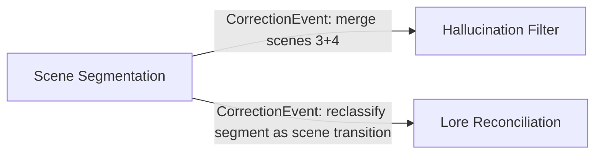

# OVP Pipeline — Architecture

## Purpose

A Rust library crate that processes multi-speaker voice audio into enriched, structured transcripts. Takes per-speaker mono f32 PCM sample streams, runs audio/speech detection, transcribes, corrects, and enriches via a chain of stateful processing stages.

**Pure processing library — no storage.** No S3, no Postgres, no filesystem. Stages make HTTP calls to external inference services (Whisper, LLM APIs, lore APIs) as part of processing. Each stage manages its own endpoints via its own config. Caller provides mono f32 samples per speaker, crate returns enriched transcript segments. Byte decoding, stereo downmix, storage, and session management are the caller's responsibility.

## What's In the Crate

The full processing pipeline from "I have mono f32 samples for each speaker" to "here are your enriched transcript segments":

- Resample to 16kHz (if input is at a different rate)
- RMS audio detection (silence gate)
- Silero VAD (speech vs non-speech)
- Whisper transcription (via external HTTP endpoint)
- Hallucination filtering
- Scene chunking
- *(Planned)* Lore reconciliation (name correction + entity linking via lore API)
- *(Planned)* Context-aware scene segmentation (LLM)

Each stage is self-contained: it has its own config with whatever HTTP endpoints it needs, manages its own calls, and transforms its input stream into its output stream. No shared HTTP client or central services config.

## What's NOT in the Crate

Everything about where audio comes from and where results go:

- Byte decoding (s16le → f32), stereo downmix, format conversion
- S3 fetching / uploading
- Database reads / writes
- Discord integration
- The lore database itself (stages query it via HTTP API)
- Craig FLAC ingestion (this is in the CLI test scaffold, not the library)
- Pseudonymization / consent logic
- Session management
- Transcript rendering (screenplay format, lane view, etc.)

The CLI binary (`ovp-cli`, behind the `cli` feature) is a **test scaffold**, not part of the library API. It handles Craig FLAC conversion and file I/O for development purposes only.

## Stage Graph

The crate receives per-speaker mono f32 sample streams. How those samples were produced is the caller's concern.

```mermaid
graph TD
    subgraph input ["Caller provides"]
        SA["Speaker A — mono f32"]
        SB["Speaker B — mono f32"]
        SC["Speaker C — mono f32"]
    end

    subgraph audio ["Audio Detection"]
        RS["Resample → 16kHz"]
        RMS["RMS Energy Gate"]
        VAD["Silero VAD"]
    end

    subgraph transcription ["Transcription"]
        W["Whisper"]
        HF["Hallucination Filter"]
    end

    subgraph enrichment ["Enrichment ― planned"]
        CT["Crosstalk Detector"]
        LR["Lore Reconciliation<br><i>name correction + entity linking</i>"]
        SS["Scene Segmentation"]
    end

    subgraph ext ["External Services ― HTTP"]
        WE(["Whisper Endpoint"])
        LORE(["Lore API"])
        LLM(["LLM API"])
    end

    SA & SB & SC --> RS
    RS -- SampleEvents --> RMS
    RMS -- AudioSegments --> VAD
    VAD -- SpeechEvents --> W
    VAD -- SpeechEvents --> CT
    W <--> WE
    W -- SegmentEvents --> HF
    CT -- CrosstalkEvents -..-> HF
    HF -- FilteredSegments --> LR
    LR <--> LORE
    LR -- ReconciledSegments --> SS
    SS <--> LLM
    SS -- EnrichedSegments --> OUT

    OUT["Enriched TranscriptSegments — returned to caller"]
```

Each stage is a stateful transformer that consumes events from its input stream, maintains internal state, and emits enriched events on its output stream.

### Forward Enrichment

Events accumulate context as they flow through the pipeline. Each stage attaches its findings to the event before passing it forward. By the time an event reaches a higher stage, it carries everything the earlier stages learned:

```
A SegmentEvent carries:
  speaker_pseudo_id    (from decode — who said it)
  speech_timing        (from VAD — when exactly)
  text + confidence    (from Whisper — what they said)
  filter flags         (from hallucination filter)
  entity_links         (from lore reconciliation)
  scene_id             (from scene segmentation)
```

**Higher stages read context off the event, not by subscribing to lower streams.** Lore reconciliation uses `speaker_pseudo_id` (already on the event) to disambiguate entities — it doesn't subscribe to SpeechEvents. Scene segmentation uses entity links (already on the event) for context — it doesn't subscribe to the lore API directly.

This keeps the graph sparse. Each stage subscribes to its direct input stream plus at most one or two cross-cutting streams (like CrosstalkEvents). Stages never fan-in to "all the streams just in case."

### Event Buffers

Every event stream maintains a sequential buffer. Stages don't just see the current event — they can query backward into any stream they subscribe to:

- **By time window:** "give me the last 30 seconds of events" — scene segmentation checks if a silence gap is a real break or a mid-scene pause
- **By count:** "give me the last 10 segments" — lore reconciliation uses recent transcript context to disambiguate references ("he" → which character, given who was just mentioned?)
- **By predicate:** "give me all CrosstalkEvents in the last 60 seconds" — scene segmentation looks for bursts of crosstalk as dramatic moment markers

Buffer depth is configurable per stream per stage. Audio-level stages need shallow buffers (seconds). Text-level stages need deeper context (minutes of transcript history). The buffer is the stage's read-only view into the past of any stream it subscribes to.

This is what makes context-aware stages possible. The hallucination filter already does this implicitly (frequency counters are a form of buffer over the full segment history). The event buffer formalizes the pattern and makes it available to all stages.

```rust
// A stage receives the current event plus a queryable view of stream history
trait Stage {
    type Output;

    fn process(
        &mut self,
        event: TaggedEvent,
        buffers: &StreamBuffers,    // read-only history for all subscribed streams
    ) -> Vec<Self::Output>;

    fn flush(&mut self) -> Vec<Self::Output>;
}

impl StreamBuffers {
    fn query_time(&self, stream: StreamId, window_secs: f32) -> &[Event];
    fn query_last(&self, stream: StreamId, count: usize) -> &[Event];
}
```

### Correction History

Every correctable event (segments, entity links, scene boundaries) retains its full correction history as append-only layers. The original value is always preserved — corrections never overwrite, they stack.

```rust
struct CorrectionLayer {
    stage: StageId,          // which stage made this correction
    pass: u32,               // which pass (0 = original, 1+ = corrections)
    old_value: String,
    new_value: String,
    reason: String,          // why — "entity_link: 'the father' → Tullus Renis"
    timestamp: f32,          // event time, not wall clock
}
```

A segment's `text` is always the latest layer. `original_text` is always layer 0 (Whisper output). The full history is available for audit, undo, and training data generation (`original → corrected` pairs).

### Back-Propagation

When a later stage discovers something that affects earlier output, it emits a `CorrectionEvent` that flows backward through the pipeline. Stages that subscribe to correction events re-evaluate their earlier output against the event buffers.



Examples:
- **Scene segmentation** realizes a silence gap was just a dramatic pause → emits CorrectionEvent → hallucination filter's scene chunker merges the two scenes
- **Scene segmentation** identifies a scene transition that changes entity context → emits CorrectionEvent → lore reconciliation re-evaluates buffered segments against the new scene context
- **Lore reconciliation** gets a lore update mid-session (new character introduced) → re-evaluates its own buffered segments against the new entity list (self-correction, not cross-stage)

**DAG constraint:** Correction events only flow from higher-abstraction stages to lower-abstraction stages, never the reverse:

```
Layer 0: Audio        (resample, RMS, VAD)
Layer 1: Transcribe   (Whisper, hallucination filter)
Layer 2: Reconcile    (lore reconciliation — name correction + entity linking)
Layer 3: Structure    (scene segmentation)
                ←── corrections flow downward only ──←
```

Layer 3 can correct layers 2 and 1. Layer 2 can correct layer 1. No upward corrections. No same-layer corrections. This eliminates recursive loops by construction.

**Self-correction** is allowed: a stage can re-evaluate its own buffer when it receives new information. Example: lore reconciliation processes "the merchant" with no match, then later processes "You meet a woman named Serena Voss" — it recognizes the introduction, creates a provisional entity, and re-scans its own buffer to link earlier "the merchant" references. This is internal re-evaluation, not a cross-layer correction, so no DAG violation.

### Deferred Corrections

Back-propagation is bounded by buffer depth. Corrections that target segments outside the buffer (e.g., a scene 8 reference to a character from scene 2) can't be applied immediately.

These corrections are captured in a **deferred correction log** — a stream of `DeferredCorrection` events that record the intent without applying it:

```rust
struct DeferredCorrection {
    target_segment_id: Uuid,
    stage: StageId,
    correction: CorrectionLayer,
}
```

After the session ends, a **finalization pass** replays the deferred correction log against the full segment set (no buffer limits — everything is in the database). This catches long-range references that the streaming pass couldn't reach.

The finalization pass is idempotent: corrections append layers, so running it multiple times produces the same result. It only runs on completed sessions, not during live streaming.

Back-propagation is also bounded by buffer depth: a stage only re-evaluates events still in its buffer. Events that have aged out are final.

Corrections always append a new layer — they never mutate the original. A segment corrected by back-propagation has its full history: Whisper output → first correction → back-propagated correction.

### Batch vs Live

In batch mode, all samples are pumped through immediately. In live mode (future), samples arrive at real-time rate. Stages don't care — they process what arrives. Event buffers and back-propagation work identically in both modes since they're indexed by event time, not wall clock time.

## Stages

### 1. Resample

**Input:** `SpeakerTrack` — per-speaker mono f32 samples at any sample rate
**Output:** `SpeakerTrack` at 16kHz (no-op if already 16kHz)

```rust
pub struct SpeakerTrack {
    pub pseudo_id: String,
    pub samples: Vec<f32>,       // Mono f32 in [-1.0, 1.0]
    pub sample_rate: u32,        // e.g. 48000 from Discord
}
```

### 2. RMS Audio Detection (Tier 1)

**Input:** 16kHz mono f32 samples
**Output:** `AudioSegment { speaker, samples, start_time, end_time }`

Cheap energy gate. Computes RMS over 30ms windows. When energy exceeds threshold, accumulates. When energy stays below threshold for a configurable gap, emits the segment. Silence never passes this stage.

```rust
pub struct RmsConfig {
    pub threshold: f32,            // Default 0.01
    pub frame_size: usize,         // Default 480 (30ms at 16kHz)
    pub silence_gap: f32,          // Default 0.5s
    pub min_segment_duration: f32, // Default 0.1s
}
```

### 3. Silero VAD (Tier 2)

**Input:** `AudioSegment` (from RMS gate)
**Output:** `AudioChunk` (confirmed speech, ready for Whisper)

Silero VAD v6 (~1.2MB ONNX model) on each audio segment. Distinguishes speech from non-speech audio (keyboard, breathing, mic bumps). May split one segment into multiple speech chunks or drop it entirely.

**Model interface (Silero VAD v6):**
- Input: `[N, 576]` frames (36ms each at 16kHz) + LSTM state `h`/`c` at `[1, 1, 128]`
- Output: `speech_probs[N]` + updated LSTM state
- State carried between batches

```rust
pub struct VadConfig {
    pub model_path: PathBuf,
    pub threshold: f32,              // Default 0.5
    pub min_speech_duration: f32,    // Default 0.25s
    pub min_silence_duration: f32,   // Default 0.8s
    pub speech_pad: f32,             // Default 0.1s
}
```

### 4. Whisper Transcription

**Input:** `AudioChunk` (confirmed speech)
**Output:** `TranscriptSegment` (text + absolute timestamps + speaker + confidence)

Encodes chunks as WAV, sends to an external OpenAI-compatible HTTP endpoint. Maps Whisper's relative timestamps to absolute session time.

```rust
pub struct TranscriberConfig {
    pub endpoint: String,
    pub model: String,
    pub language: Option<String>,
}
```

### 5. Filter Chain

Pluggable via the `StreamFilter` trait. Crate ships two filters:

**Hallucination Detection:** Frequency-based, no hardcoded phrase list. With RMS+VAD in place, this is a secondary defense. Also handles **cross-speaker deduplication** — when audio bleed causes the same text to appear on multiple speaker tracks at overlapping timestamps, the duplicate is excluded (uses CrosstalkEvents from the crosstalk detector to identify overlap windows).

**Scene Chunker:** Assigns `chunk_group` to segments based on silence gaps and duration limits.

## Public API

```rust
pub async fn process_session(
    config: &PipelineConfig,
    input: SessionInput,
    filters: &mut [Box<dyn StreamFilter>],
) -> Result<PipelineResult>
```

```rust
pub struct PipelineConfig {
    pub rms: RmsConfig,
    pub vad: VadConfig,
    pub whisper: TranscriberConfig,
    pub min_chunk_duration: f32,     // Drop speech < this (default 0.8s)
}

pub struct SessionInput {
    pub session_id: Uuid,
    pub tracks: Vec<SpeakerTrack>,   // Per-speaker PCM streams
}

pub struct PipelineResult {
    pub segments: Vec<TranscriptSegment>,
    pub segments_produced: u32,
    pub segments_excluded: u32,
    pub scenes_detected: u32,
    pub duration_processed: f32,
}
```

## Crate Structure

```
ovp-pipeline/
├── Cargo.toml
├── models/
│   └── silero_vad_v6.onnx         # ~1.2MB, gitignored
├── docs/
│   └── architecture.md
├── src/
│   ├── lib.rs                      # Public API + re-exports
│   ├── types.rs                    # SpeakerTrack, AudioChunk, TranscriptSegment, etc.
│   ├── error.rs                    # PipelineError enum
│   ├── pipeline.rs                 # Orchestration: decode → resample → RMS → VAD → Whisper → filters
│   ├── ad/
│   │   └── mod.rs                  # RMS audio detection (tier 1)
│   ├── audio/
│   │   ├── mod.rs
│   │   ├── resample.rs             # Any rate → 16kHz via rubato
│   │   ├── encode.rs               # Stub: f32 → Opus/OGG (future)
│   │   └── mix.rs                  # Stub: multi-track mixing (future)
│   ├── vad/
│   │   └── mod.rs                  # Silero VAD v6 via ort (tier 2)
│   ├── transcribe/
│   │   └── mod.rs                  # Whisper HTTP endpoint client
│   └── filters/
│       ├── mod.rs                  # StreamFilter trait + apply_filters
│       ├── hallucination.rs        # Frequency-based detection
│       └── scene_chunker.rs        # Scene boundaries
└── src/bin/
    └── cli.rs                      # TEST SCAFFOLD (not library API)
```

## Dependencies

| Crate | Purpose | Feature-gated |
|-------|---------|---------------|
| `tokio` | Async runtime | no (core) |
| `serde` / `serde_json` | Serialization | no (core) |
| `uuid` | Segment/session IDs | no (core) |
| `tracing` | Structured logging | no (core) |
| `async-trait` | StreamFilter trait | no (core) |
| `thiserror` | Error types | no (core) |
| `ort` | ONNX Runtime for Silero VAD | `vad` feature |
| `ndarray` | Tensor construction for ort | `vad` feature |
| `reqwest` | HTTP client for Whisper | `transcribe` feature |
| `rubato` | Sample rate conversion | `transcribe` feature |

CLI-only deps (`cli` feature): `clap`, `symphonia-*`, `sha2`, `hex`, `chrono`, `tracing-subscriber`

## Design Principles

1. **Pure processing library.** No storage, no database, no filesystem. Caller handles all I/O except Whisper HTTP.

2. **PCM in, transcript segments out.** The crate doesn't know or care where audio came from.

3. **Two-tier audio detection.** RMS energy gate (cheap) → Silero VAD (ML). Silence never reaches Whisper.

4. **Transport boundaries are invisible.** After decode, audio is a continuous stream. How the caller chunked the input is irrelevant.

5. **Stages are standalone functions.** Typed input → typed output. Independently testable.

6. **Filters are pluggable.** `StreamFilter` trait. Consumers add custom filters without modifying the crate.

7. **Errors propagate, don't panic.** `thiserror` + `?`.

8. **Feature-gated heavy deps.** ONNX runtime, reqwest, rubato behind feature flags.
